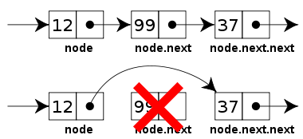
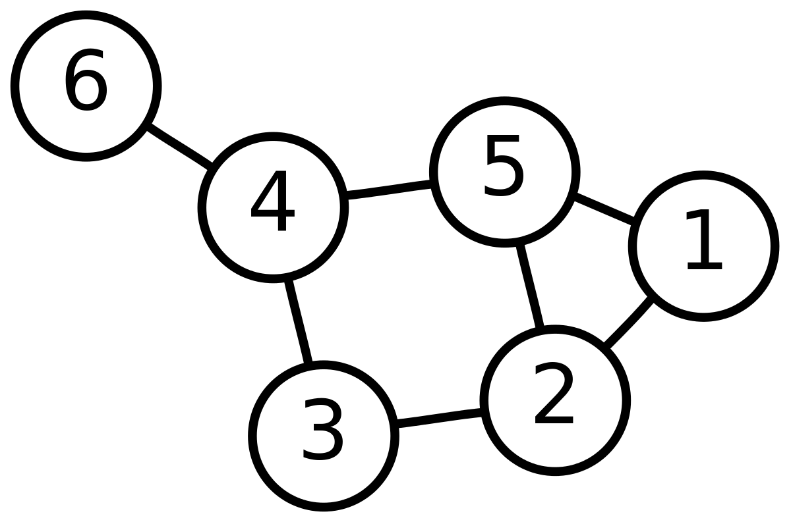

# データ構造
### This was created during my time as a [Code Chrysalis](https://codechrysalis.io) Student

## 目次

1.  [導入](#導入)
1.  [各トピックの概要](#各トピックの概要)
1.  [環境](#環境)
    1.  [依存パッケージのインストール](#依存パッケージのインストール)
1.  [目的 & 説明](#目的%20&%20説明)
    1.  [基本演習](#基本演習)
    1.  [中級演習](#中級演習)
    1.  [上級演習](#上級演習)
1.  [参考資料](#参考資料)
1.  [コントリビューション](#コントリビューション)

## 導入

この世界では、データベースを作ったり、コードを実行したり、ブラウザに「 www.example.com 」を入力した時ユーザーを正しい場所へ案内するために、さまざまなデータ構造が活用されています。
とはいえ複雑な技術に取り組む前に、まずは基本的なデータ構造をおさえておきましょう。

エンジニアとして、私たちはさまざまなデータを扱っており、それらは格納したり、アクセスしたり、順番を並び替えたり、UI 上に表示したりします。私たちが書いているコード自体も単純なデータであり、それを解析してデータ構造に落とし込むことで、コードの最適化や実行が実現されています。今回の演習の内容は、あらゆる偉大なエンジニアにとっての基礎知識となるもので、テクニカル・インタビューを通過するためだけでなく、ソフトウェアに関してよく理解した上で判断を下したり、物事が深層ではどのように動いているか、自分自身の理解を深めたりするために必要なものとなっています。

この演習では、JavaScript を用いて、一般によく知られているいくつかのデータ構造を実際に作ってもらいます。新たなデータ構造について学習する際は、以下のステップを参考にしてください。なお、データ構造を利用した完璧なソリューションというものは存在しません。したがって、それぞれのデータ構造は、どういった問題に対して有効なのか、そしてそのデータ構造にはどういった限界があるのか、といったことを念頭に置きながら課題を解き進めていってください。

1.  メンタルモデルを作る
    - モデルを描き出す
    - 基本的な操作を備えた API を大まかに書き出す
      - 典型的な操作としては、追加や削除、検索、更新などがありますが、データ構造によっては差異があります。
    - テストを読んで、より明確なイメージをつかむ
1.  組み立てる
    - 疑似コードで実装方法を書き出す
    - 実際の例を用いて疑似コードの内容を確かめる
    - コードを書く
    - いくつかのエッジケースについても想定できているか検討する
1.  使ってみる
    - 作ったデータ構造が動くか、試してみましょう！
    - テストを書き足して、よりさまざまなエッジケースに対応できているか確認する
    - 必要に応じてアルゴリズムを組み合わせてみる
1.  分析する
    - 時間計算量はいくらか？
    - どうすれば最適化できるか？

## 各トピックの概要

### 連結リスト



連結リストは線形データ構造のひとつで、配列に大変よく似ています。配列はデータを隣接しあったメモリブロックに格納しますが、連結リストのデータは次の要素を指すポインタによってお互いに繋がっています。

#### なぜ連結リストを用いるのか

配列でも似たような種類の線形データを格納することはできますが、配列の末尾以外の場所では挿入と消去ができず、それぞれのインデックスを更新するためにデータ構造全体をシフトしていく作業には無駄が多いため、連結リストが必要になってきます。

たとえば、昇順に整理された ID の配列 `id` を考えてみましょう。

`const id = [1000, 1010, 1050, 2000, 2040];`

もしここに新たな ID 1005 を挿入し、昇順に並び替えようとすると、1000 より後ろの要素すべてを移動して、インデックスに 1 を足さなければいけません。
また、消去においても同様で、なにか特別なテクニックを用いない限り、配列から要素を除く作業には無駄が生じます。たとえば、`id` から 1010 を消去する場合、1010 以降のすベての要素は、インデックスを 1 つ減らさなければいけません。

#### （配列に対する）連結リストの優位性

1.  動的なサイズを持つ（JS 以外の言語では特に問題になります）
1.  挿入 / 消去が容易

#### 欠点

- 任意の要素にランダムにアクセスすることはできません。連結リストでは、最初のノードから順番にたどっていく必要があります。たとえば、配列の `id[0]` にアクセスするために必要な検索時間は一定ですが、連結リストではそうではありません。要素を検索するためには、連結リスト全体をループしなければいけないからです。
- リストの各要素が `next` ポインタを持つので、そのポインタ一つ一つのために余分なメモリー空間を消費する必要があります。

### ツリー構造（木構造）

DOM を触ったことがあれば、ツリー構造（木構造）には見覚えがあることでしょう！　ツリー構造は DOM における親要素や子要素のような、階層型データを扱うのに優れています。ツリー構造を用いれば、これまでに習った連結リストやスタック、キューのような、ノード間で 1 つの関係しか保有できないデータ構造の概念を拡張することができます。ツリー構造では、ノード間でさまざまな関係を構築することが可能で、配列や連結リスト、スタックやキューが線形データ構造であるのに対し、ツリー構造は階層型データ構造をしています。

#### ツリー構造に関する語彙

ツリーの頂上を形成するノードのことを、ツリー構造の根ノードと呼びます。ある要素の直下にある要素は、子ノードといい、要素の真上に位置する要素については親ノードといいます。そして子ノードのない要素は葉ノードと呼ばれます。


#### なぜツリー構造を用いるのか

- そもそもヒエラルキーを形成するような情報を扱う際には、ツリー構造を使うとよいかもしれません。たとえば、DOM が良い例です。


- （二分探索木のように順番が整った）ツリー構造は検索に適しています（連結リストより速く、配列よりは遅い）。
- ツリー構造は挿入と削除にも適しています（配列より速く、順番の整理されていない連結リストよりも遅い）。
- 連結リストと同じく、ノードの連結にポインタを用いるため、ノード数に上限はありません。

#### ツリー構造の主な応用例

1.  DOM のような階層型データの整理・操作
1.  情報の検索を容易にしたいとき
1.  整列されたデータの操作
1.  ルーティング・アルゴリズム
1.  決定木を利用した多段階意思決定の実現
1.  抽象構文木を用いた統語論の構文解析

#### 二分木

あるツリー構造の要素が 2 つ以下の子ノードを持つとき、そのツリーは二分木と呼ばれます。二分木の各要素は 2 つの子ノードしか持てないので、その子ノードは特に、左・右と呼ばれます。

### 二分探索木

二分探索木（BST）は、以下のような性質を持った二分木のデータ構造のことです。

1.  あるノードの左の部分木には、そのノードより少ない数のキーを持ったノードだけが存在する。
1.  あるノードの右の部分木には、そのノードより多い数のキーを持ったノードだけが存在する。
1.  左・右の部分木もまた、二分探索木でなければならない。
1.  同じノードがあってはならない。


#### なぜ二分探索木が用いられるのか

BST は、要素の検索を高速に（ log(n) で）したいときに用いられます。上に記した BST の性質によって、キー間の順番には整合性が保たれており、検索、そして最小・最大の計算などの操作が高速でできます。順番が整理されていない場合は、探しているキーを全てのキーと照合しなければいけない可能性があります。

### グラフ

グラフは次の 2 つの構成要素から成り立つデータ構造のことです。

1.  有限数の頂点（ノード）の集合
1.  有限数の、整理されたノードのペア（エッジ）。これが頂点同士の関係性を示す。エッジには方向、重み、値やコストなどが含まれる。


#### なぜグラフを用いるのか

グラフは、現実世界のさまざまな現象を表すために利用されています。とりわけ、ネットワークを表現するために使われることが多いといえるでしょう。ここでのネットワークには、地図上の道路や、回線網、多孔質な物質のネットワーク状をした穴の関係性や迷路などを含みます。グラフは Facebook や Twitter のような SNS にも用いられています。もしかしたら、Facebook のグラフ API などは聞いたことがあるかもしれません。

#### Facebook の場合

Facebook を人々とその友人からなるネットワークとみなすと、それぞれの人物は頂点（ノード）として表されます。各ノードは一つの構造体であり、その人の ID や名前、ジェンダーや地域といった情報を格納することになります。それぞれの辺は、Facebook のグラフ上の人物がほかの人々とつながっていることを示します。このような、Facebook 上の友達との関係性、これがエッジです。

下の図は、6 つの頂点から成る無向グラフの例です。



#### グラフの表し方

下の 2 つが、もっとも一般的なグラフの表し方です。

1.  隣接行列
1.  隣接リスト

ほかにもグラフは、接続行列や incidence list などによって表すことができます。グラフを使用するかどうかは状況によりけりで、どのような操作に利用するのか、またその操作は容易なのか、などによって判断が分かれます。今回の演習では、グラフを隣接リストとして扱います。

接続リストが実質ツリー構造をしているように、ツリー構造は事実上、グラフです。

### ヒープ

二分ヒープは、次のような性質を持った二分木のことを指します。

1.  完全にバランスの取れたツリーである（最下層以外では、左または右の子ノードしか持たないノードが存在せず、最下層は残った全てのキーを保持している）。この性質があるため、二分ヒープは配列に格納しやすい。
1.  二分ヒープは、最小ヒープまたは最大ヒープのいずれかである。最小ヒープでは、根ノードのキーがその二分ヒープのあらゆるキーにおける最小を表す。この性質は、二分ヒープ中のあらゆるノードについて再帰的にあてはまる。最大ヒープも最小ヒープと同様の仕組みから成り立つ。

#### なぜヒープを用いるのか

最小または最大を表す要素をコンスタントに変わらない時間で取り出す必要がある際に、ヒープまたは優先度付きキューが用いられます。

#### 二分ヒープはどう表すのか？

二分ヒープは完全二分木です。二分ヒープを表す典型的な方法は、配列です。下の図は、最小ヒープをツリー構造で表しており、それがどう配列に格納されるかを示しています。


#### ヒープの応用例

1.  ヒープソート。ヒープソートは二分ヒープを用いており、O(nLogn) の計算量オーダーで配列をソートします。
1.  優先度付きキュー。優先度付きキューは、二分ヒープを用いることで効果的に実装することができます。なぜなら、insert() 、delete() 、extractmax() 、decreaseKey() といった操作を O(logn) で実行できるからです。
1.  グラフアルゴリズム。グラフアルゴリズムは特に、最短経路問題のダイクストラ法や最適化問題のプリム法などに利用されています。

### ハッシュテーブル

ハッシュテーブルは、キーと値のペアを格納し、次の 2 つの要素から成り立っています。

1.  ハッシュを生み出すハッシュ関数。個々のハッシュは、ある特定のインデックスに対応するキーを持っている。
1.  キーと値のペアを格納する配列。


#### なぜハッシュテーブルを用いるのか

ハッシュテーブルは、キーを用いて、一定時間である値を取り出したり、挿入したり、あるいは消去したりするのに使われます。比較的シンプルに扱うことができるため、ハッシュテーブルはもっとも人気のあるデータ構造の一つとなっています。

JavaScript のオブジェクトを使うときはいつでも、深層部でこのハッシュテーブルが用いられています。

## 環境

### 依存パッケージのインストール

依存パッケージをインストールする方法は以下の通り。

```shell
npm install [OR] yarn install
```

## 目的 & 説明

### 学習の目的

- 抽象的なデータ構造の概念を JavaScript のコードで表現できるようになること。
- 以下のデータ構造の基本的な仕組みや操作方法を理解すること。
  - 連結リスト
  - ツリー構造
  - 二分探索木
  - グラフ
  - ハッシュテーブル
  - ヒープ
- データ構造の基本的な操作に必要な計算量を分析できるようになること。
- 各データ構造の長所と短所および実用例を説明できるようになること。

## 基本演習

下記のデータ構造のためにクラスを作っていく際、テストを自分のロードマップとして利用しましょう。テストはあらゆる可能性をカバーしているわけではありません。もしも足りないと思うテストがあれば、自分で適宜補ってください。また、既存のテストは、あなたの書くコードのスタイルや解き方を想定したものではない可能性もあります。その場合は、テストを消したり変更を施したりしても構いません。テストはあくまでガイドラインであり、絶対のルールではありません！　意図的にあらゆる可能性をカバーしていないこともありますので、その場合も自分でテストを補ってくださいね！

**基本演習内の全てのデータ構造のテストをクリアするまでは、先の演習に進まないこと。**

- [ ] `LinkedList`

  - [ ] `LinkedList` は ES6 のクラスのインスタンスを返す
  - [ ] `.appendToTail(value)` は、末尾に新たなノードを追加し、その新たなノードを返す
  - [ ] `.removeHead()` は、連結リストの先頭のノードを取り除き、その取り除いたノードを返す
  - [ ] `.findNode(value)` は、引数として渡されたものと同じ値を持つ最初のノードを返し、もしその値が見つからなかった場合には null を返す
  - [ ] 時間計算量はいくら？

- [ ] `Tree`

  - [ ] `Tree` は、ES6 のクラスのインスタンスを返す
  - [ ] `.addChild(value)` は、ツリー / サブツリーに子ノードを追加し、その新しい子ノード（これ自体も Tree のインスタンスとなるはず）を返す
  - [ ] `.contains(value)` は、引数としてとった値がツリー内に存在すれば true を返し、存在しなければ false を返す
  - [ ] `.remove(value)` は、引数の値をツリーから取り除き、その取り出された値を返す。このメソッドについては、自分でテストを書いてみましょう。
  - [ ] 時間計算量はいくら？

- [ ] `BinarySearchTree`

  - [ ] `BinarySearchTree` は、ES6 のクラスのインスタンスを返す
  - [ ] `.insert(value)` は、引数の値をツリー内の正しい位置に挿入し、ツリーを返す（チェーン状になっているため）
  - [ ] `.contains(value)` は、引数の値がツリー内に存在すれば true を返し、存在しなければ false を返す
  - [ ] `.traverseDepthFirstInOrder(callback)` は、深さ優先探索（まず左の部分木から始め、次に現在のノード、そして右の部分木に移動）によって、すべてのノードに対しコールバックを実行し、undefined を返す
  - [ ] 時間計算量はいくら？

  > 注意： 間順走査（In-Order traversal）は、二分木においてもっともよく知られた、各要素へのアクセス方法です。二分探索木においては、ノードを昇順（in ascending order）でループ処理することになります（それゆえ in-order traversal と呼ばれる）。

- `Graph`

  - [ ] `Graph` は、ES6 のクラスのインスタンスを返す
  - [ ] `.addNode(value)` は、プリミティブ型の値を持つノードをグラフに追加し、undefined を返す
  - [ ] `.removeNode(value)` は、グラフからノードを取り除き、undefined を返す
  - [ ] `.contains(value)` は、ブーリアン型を返す。もし引数の値がグラフ内にあれば true を、なければ false を返す
  - [ ] `.addEdge(value1, value2)` は、undefined を返す。もしもどちらの値もそのグラフ内に存在すれば、2 つのノード間にエッジを作る
  - [ ] `.removeEdge(value1, value2)` は、undefined を返す。
  - [ ] `.hasEdge(value1, value2)` は、ブーリアン型を返す。もしエッジが存在すれば true を、存在しなければ false を返す
  - [ ] 時間計算量はいくら？

- [ ] `HashTable`
  - [ ] `HashTable` は、ES& のクラスのインスタンスを返す
  - [ ] `.insert(key, value)` は、格納用の配列にキーと値の組を格納する。もしもそのキーが配列内にすでに存在する場合、既存の値を新しい値に置き換える。キーを整数と対応させて、所定のインデックスに値を格納するため、ハッシュ関数を使うこと。データが衝突する可能性に注意。
  - [ ] `.retrieve(key)` は、引数のキーに対応する値を返す
  - [ ] `.remove(key)` は、格納用の配列からキーと値を取り出し、操作が成功したかどうかをブーリアン型で返す
  - [ ] 時間計算量はいくら？

## 中級演習

- [ ] `Heap`
  - [ ] `Heap` は、ES6 のクラスのインスタンスを返す
  - [ ] `insert(value)` は、そのヒープ・プロパティおよびシェイプ・プロパティに応じて、ヒープに値を追加し、undefined を返す
  - [ ] `removeMax()` は、ヒープから最大値を取り除き、ヒープを再整理し、新たな最大値を返す
  - [ ] 時間計算量はいくら？

## 上級演習

- [ ] `LinkedList`

  - [ ] `.forEach(callbackFn)` は、各ノードの値を引数にとってコールバック関数を実行し、何も返さない
  - [ ] `.print()` は、リスト内の全ての値を文字列にして返す（例： '0, 1, 2, 3'）
  - [ ] `.insertHead(value)` は、引数の値を持つ新たなノードを先頭に追加し、その新しく追加されたノードを返す
  - [ ] `.insertAfter(refNode, value)` は、第二引数として渡された値に紐付けられた新たなノードを refNode のあとに挿入し、その新しく挿入されたノードを返す
  - [ ] `.removeAfter(refNode)` は、refNode のあとに来るノードを取り除き、その取り除かれた古いノードを返す

- [ ] `Tree`

  - [ ] `.traverseDepthFirst(callback)` は、undefined を返す。深さ優先探索によってすべてのノードでコールバックを実行する
  - [ ] `.traverseBreadthFirst(callback)` は、undefined を返す。幅優先探索によってすべてのノードに対しコールバックを実行する

- [ ] `BinarySearchTree`

  - [ ] `.traverseBreadthFirst(callback)` は、幅優先探索によってすべてのノードに対しコールバックを実行し、undefined を返す
  - [ ] `.traverseDepthFirstPreOrder(callback)` は、前順（現在のノードを調査してから子ノードに移る）の深さ優先探索によってすべてのノードに対しコールバックを実行する
  - [ ] `.traverseDepthFirstPostOrder(callback)` は、後順（子ノードを調査してから現在のノードに移る）の深さ優先探索によってすべてのノードに対しコールバックを実行する
  - [ ] `.checkIfFull()` は、すべてのノードが 0 個または 2 個のノードを持っている（1 つしか子ノードを持たないノードが存在しない）ときに true を返し、BST が完全でないときに false を返す
  - [ ] `.checkIfBalanced()` は、BST が平衡であるときにブーリアン型を返す。この演習では、最小の高さと最高の高さの差が 1 以下であるときに平衡であるとする。分木の高さは根からの階層の数とする。

- [ ] `Graph`

  - [ ] `forEach(callback)` は、undefined を返す。グラフの各要素にアクセスし、それぞれのノードに対し、引数として渡されたコールバックを一度だけ実行する。コールバック関数は各ノードにおいて、ノードの値・ノードの近傍・すべてのノードの 3 つを受け取るものとする。
  - [ ] 深さ優先探索・幅優先探索による走査メソッドを実装せよ。これらのメソッドは、ループ処理を開始する最初のノードと、各ノードに対して実行されるコールバックを引数に取るものとする。コールバックは、2 つの実引数を受け取るものとし、1 つめはノードの値、2 つめはノード間の距離（ループ処理を開始したノードからそのノードまでを隔てるエッジの数）とする。

- [ ] `HashTable`
  - [ ] ハッシュテーブルをリサイズせよ。
    - [ ] カウント（キーと値のペア数）がテーブルサイズの 75% を超えたら、テーブルサイズを 2 倍し、キー / 値のペアを再配分すること。
    - [ ] カウントがテーブルサイズの 25% を下回ったら、テーブルサイズを 1/2 にし、キー / 値のペアを再配分すること。
  - [ ] 二分探索木でハッシュテーブルを実装せよ。

## 参考資料

Harvard CS50 Data Structure の映像

- [連結リスト入門](https://www.youtube.com/watch?v=5nsKtQuT6E8)
- [ツリー構造と BST 入門](https://www.youtube.com/watch?v=mFptHjTT3l8)
- [グラフ丹生右門](https://www.youtube.com/watch?v=h2d9b_nEzoA)
- [ハッシュテーブル入門](https://www.youtube.com/watch?v=h2d9b_nEzoA)
- [ヒープ入門](https://www.youtube.com/watch?v=t0Cq6tVNRBA)

## コントリビューション

以下はカリキュラムに残し、この文章は削除してください。

問題を見つけましたか？　もっと改善できるところがありましたか？　それなら、[カリキュラムにコントリビュートしましょう](mailto:hello@codechrysalis.io)！
